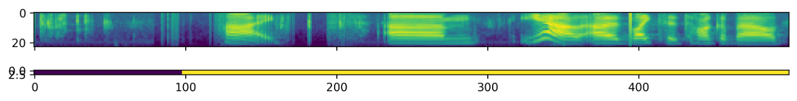

[](https://actions-badge.atrox.dev/pzelasko/lhotse/goto?ref=master)
[](https://lhotse.readthedocs.io/en/latest/?badge=latest)
[](https://codecov.io/gh/pzelasko/lhotse)

# Lhotse

Lhotse is a Python library aiming to make speech and audio data preparation flexible and accessible to a wider community. Alongside [k2](https://github.com/danpovey/k2), it is a part of the next generation [Kaldi](https://github.com/kaldi-asr/kaldi) speech processing library. 

⚠️ **Lhotse is not stable yet - while many features are already implemented, the APIs are still subject to change!** ⚠️

## About

### Main goals

- Attract a wider community to speech processing tasks with a **Python-centric design**.
- Accommodate experienced Kaldi users with an **expressive command-line interface**.
- Provide **standard data preparation recipes** for commonly used corpora.
- Provide **PyTorch Dataset classes** for speech and audio related tasks.
- Flexible data preparation for model training with the notion of **audio cuts**.
- **Efficiency**, especially in terms of I/O bandwidth and storage capacity.

### Main ideas

Like Kaldi, Lhotse provides standard data preparation recipes, but extends that with a seamless PyTorch integration through task-specific Dataset classes. The data and meta-data are represented in human-readable text manifests and exposed to the user through convenient Python classes.

Lhotse introduces the notion of audio cuts, designed to ease the training data construction with operations such as mixing, truncation and padding that are performed on-the-fly to minimize the amount of storage required. Data augmentation and feature extraction are supported both in pre-computed mode, with highly-compressed feature matrices stored on disk, and on-the-fly mode that computes the transformations upon request. Additionally, Lhotse introduces feature-space cut mixing to make the best of both worlds.

## Installation

Lhotse supports Python version 3.7 and later.

### Pip

Once it's more stable, we will upload Lhotse to pip.

### Development installation

For development installation, you can fork/clone the GitHub repo and install with pip:

    git clone https://github.com/pzelasko/lhotse
    cd lhotse
    pip install -e '.[dev]'

    # Running unit tests
    pytest test

This is an editable installation (`-e` option), meaning that your changes to the source code are automatically
reflected when importing lhotse (no re-install needed). The `[dev]` part means you're installing extra dependencies
that are used to run tests, build documentation or launch jupyter notebooks.


## Examples

We have example recipes showing how to prepare data and load it in Python as a PyTorch `Dataset`.
They are located in the `examples` directory.

A short snippet to show how Lhotse can make audio data prepartion quick and easy:

```python

from lhotse import CutSet, Fbank
from lhotse.dataset import VadDataset 
from lhotse.recipes import prepare_switchboard

# Prepare data manifests from a raw corpus distribution.
# The RecordingSet describes the metadata about audio recordings;
# the sampling rate, number of channels, duration, etc.
# The SupervisionSet describes metadata about supervision segments:
# the transcript, speaker, language, and so on.
swbd = prepare_switchboard('/export/corpora3/LDC/LDC97S62')

# CutSet is the workhorse of Lhotse, allowing for flexible data manipulation.
# We create 5-second cuts by traversing SWBD recordings in windows.
# No audio data is actually loaded into memory or stored to disk at this point.  
cuts = CutSet.from_manifests(
    recordings=swbd['recordings'],
    supervisions=swbd['supervisions']
).cut_into_windows(duration=5)

# We compute the log-Mel filter energies and store them on disk;
# Then, we pad the cuts to 5 seconds to ensure all cuts are of equal length,
# as the last window in each recording might have a shorter duration.
# The padding will be performed once the features are loaded into memory.
cuts = cuts.compute_and_store_features(
    extractor=Fbank(),
    output_dir='make_feats'
).pad(duration=5.0)

# Construct a Pytorch Dataset class for Voice Activity Detection task:
dataset = VadDataset(cuts)
dataset[0]
```

The `VadDataset` will yield a pair of input and supervision tensors such as the following - 
the speech starts roughly at the first second (100 frames): 


