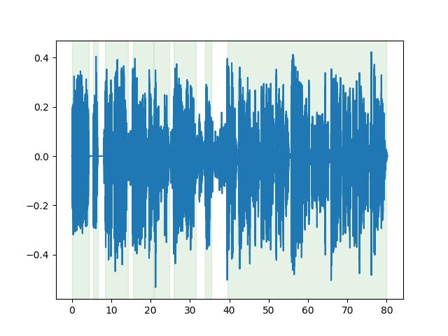
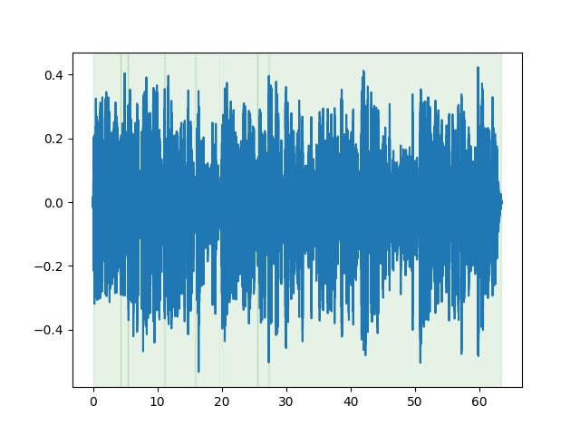

# Activity Detection

The Activity Detection module provides tools for detecting activity in audio recordings. It includes the following components:

- `ActivityDetector` base class, designed to facilitate the integration of new activity detection methods in the future.
- `SileroVAD8k` and `SileroVAD16k` models for voice activity detection, which integrate the [Silero VAD](https://github.com/snakers4/silero-vad) model for activity detection.

## Workflow (CLI)

Collection of tools for activity detection is available as a CLI workflow. It allows you to run activity detection on a dataset and save the results to a new SupervisionSet. It also allows you to trim the recordings based on the activity detection results.

### Detect Voice Activity in Recordings

This workflow allows you to detect activity in recordings and save the results to a new SupervisionSet. It will create a new SupervisionSet with annotated activity segments by ActivityDetector.

1. Read the Help

    ```bash
    lhotse workflows detect-activity --help
    ```

2. Run activity detection workflow using one of activity detection models, e.g. Silero VAD:

    ```bash
    lhotse workflows detect-activity \
    --model-name silero_vad_16k \
    --recordings-manifest data/librispeech_recordings_train-clean-5.jsonl.gz \
    --output-supervisions-manifest librispeech_recordings_train-clean-5.jsonl.gz \
    --jobs 2 \
    --device cpu
    ```

    or on a GPU (cuda):

    ```bash
    lhotse workflows detect-activity \
    --model-name silero_vad_16k \
    --recordings-manifest data/librispeech_recordings_train-clean-5.jsonl.gz \
    --output-supervisions-manifest librispeech_recordings_train-clean-5.jsonl.gz \
    --jobs 2 \
    --device cuda
    ```

    Output:

    ```bash
    Checking model state in cache...
        Using cache found in /.../.cache/torch/hub/snakers4_silero-vad_master
    Making activity detection processor for 'silero_vad_16k'...
    Loading recordings from /.../data/librispeech_recordings_train-clean-5.jsonl.gz...
    Multiprocessing: 100%|████████████████████| 1519/1519 [07:13<00:00,  3.50task/s]
    Saving 'silero_vad_16k' results ...
    Results saved to:
    /.../librispeech_recordings_train-clean-5.jsonl.gz
    ```

### Cleaning up the dataset from silence

This workflow allows you to trim the recordings based on the activity detection results. It will create a new CutSet with trimmed recordings and a new SupervisionSet with updated supervision segments.

1. Read the Help

    ```bash
    lhotse workflows trim-inactivity --help
    ```

2. Run inactivity trimming workflow using one of activity detection models, e.g. Silero VAD:

    ```bash
    lhotse workflows trim-inactivity \
    --model-name silero_vad_16k \
    --recordings-manifest data/librispeech_recordings_train-clean-5.jsonl.gz \
    --supervisions-manifest data/librispeech_supervisions_train-clean-5.jsonl.gz \
    --output-dir librispeech_silero_vad \
    --output-recordings-extension wav \
    --jobs 2 \
    --device cpu
    ```

    Output:

    ```bash
    Checking model state in cache...
        Using cache found in /.../.cache/torch/hub/snakers4_silero-vad_master
    Multiprocessing: 100%|██████████████████████████████████████████| 1519/1519 [11:10<00:00,  2.27task/s]
    Decomposing cuts: 100%|█████████████████████████████████████████| 1519/1519 [00:00<00:00, 9822.92it/s]

    ```

3. Now you can find your trimmed recordings and manifest files:

    ```bash
    tree librispeech_silero_vad -L 1 -F
    ```

    ```plain
    librispeech_silero_vad/
    ├── cuts.json.gz
    ├── recordings.jsonl.gz
    ├── speach-only-report.csv
    ├── storage/
    └── supervisions.jsonl.gz
    ```

## Trubleshooting

If you encounter the following errors while running the activity detection.

- **FileNotFoundError**: No such file or directory: /.../.cache/...
- **ValueError**: The provided filename /.../.cache/... does not exist.

Try to run the activity detection workflow with the `--force_download` flag. It will clear the cache and download the model again.

## Example usage in python code

### Silero VAD for single Recording

The Silero VAD model can be used to detect activity in a single recording.

```python
from pathlib import Path

import lhotse
from lhotse.audio import RecordingSet
from lhotse.workflows.activity_detection import SileroVAD16k

vad = SileroVAD16k(device="cpu")  # or device="cuda"

# load recordings
lhotse_root = Path(lhotse.__file__).parent.parent
recordings_path = lhotse_root / "test" / "fixtures" / "libri" / "audio.json"
recordings = RecordingSet.from_file(recordings_path).with_path_prefix(lhotse_root)
recordings = recordings.resample(vad.sampling_rate)

# run voice activity detection
vad(recordings[0].load_audio())

```

Detection result for the first recording:

```plain
[Activity(start=0.194, duration=2.204),
 Activity(start=2.754, duration=5.98),
 Activity(start=9.602, duration=6.438)]
```

### Silero VAD for a RecordingSet

The Silero VAD model can be used to detect activity in a RecordingSet. You can use the `detect_activity` function to run activity detection on a RecordingSet. It works in a similar way as the CLI workflow.

```python
from pathlib import Path

import lhotse
from lhotse.audio import RecordingSet
from lhotse.workflows.activity_detection import detect_activity

# load recordings
lhotse_root = Path(lhotse.__file__).parent.parent
recordings_path = lhotse_root / "test" / "fixtures" / "libri" / "audio.json"
recordings = RecordingSet.from_file(recordings_path).with_path_prefix(lhotse_root)
recordings = recordings.resample(vad.sampling_rate)

supervisions = detect_activity(recordings, "silero_vad_16k", device="cpu", verbose=True)
supervisions.segments
```

Detection result for all recordings:

```plain
Multiprocessing: 100%|██████████████████████████| 1/1 [00:04<00:00,  4.33s/task]
{'recording-1-silero_vad_16k-0-00000': SupervisionSegment(id='recording-1-silero_vad_16k-0-00000', recording_id='recording-1', start=0.194, duration=2.204, channel=0, text=None, language=None, speaker=None, gender=None, custom=None, alignment=None),
 'recording-1-silero_vad_16k-0-00001': SupervisionSegment(id='recording-1-silero_vad_16k-0-00001', recording_id='recording-1', start=2.754, duration=5.98, channel=0, text=None, language=None, speaker=None, gender=None, custom=None, alignment=None),
 'recording-1-silero_vad_16k-0-00002': SupervisionSegment(id='recording-1-silero_vad_16k-0-00002', recording_id='recording-1', start=9.602, duration=6.438, channel=0, text=None, language=None, speaker=None, gender=None, custom=None, alignment=None)}
```

## Clean up the dataset from silence

You can use the `trim_inactivity` function to trim the recordings based on the activity detection results. It works in a similar way as the CLI workflow. It will create a new CutSet with trimmed recordings and a new SupervisionSet with updated supervision segments. You can specify the output directory to save the trimmed recordings to disk. If output directory is provided, the prepared recordings and supervision segments will be saved. If you don't specify the output directory, the recordings will be stored in memory.

For this example we will use the VoxConverse dataset. We specify the `protect_outside` parameter to `False` to not protect SupervisionSegments outside of the trimmed cuts. Also, we use cuda to run the activity detection on GPU and we use 2 processes to run the activity detection in parallel. Unfortunately, the Silero VAD is an LSTM-based model, and the use of GPUs does not speed up processing significantly. However, it is still faster than running on CPU.

```python
from lhotse import CutSet, RecordingSet, SupervisionSet
from lhotse.workflows.activity_detection import trim_inactivity

cuts = CutSet.from_manifests(
    recordings=RecordingSet.from_file(
        "voxconverse_prepared/voxconverse_recordings_dev.jsonl.gz"
    ),
    supervisions=SupervisionSet.from_file(
        "voxconverse_prepared/voxconverse_supervisions_dev.jsonl.gz"
    ),
)

trim, report = trim_inactivity(
    cuts,
    output_dir=None,  # Store recordings in memory
    detector="silero_vad_16k",
    num_jobs=2,
    device="cuda", # Use GPU
    verbose=True, # Print progress
    warnings_mode="ignore",
    protect_outside=False,
)
```

```plain
Using cache found in /home/rilshok/.cache/torch/hub/snakers4_silero-vad_master
Multiprocessing:  41%|█████████▍             | 89/216 [11:32<12:20,  5.83s/task]
```

```python
cuts['bwzyf-16'].plot_audio();
```




```python
trim['bwzyf-16'].plot_audio();

```


